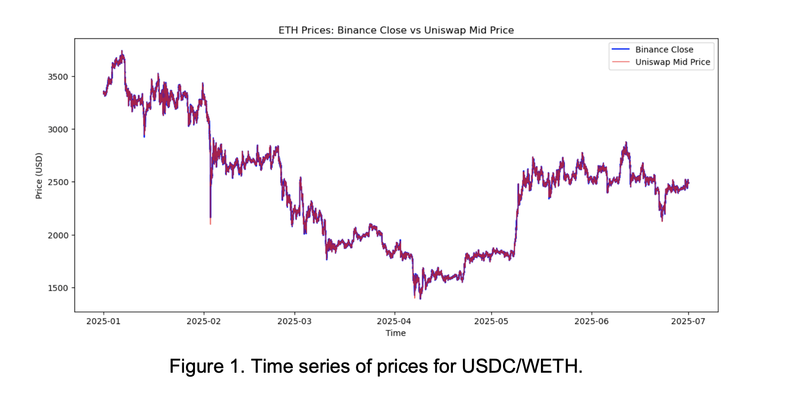
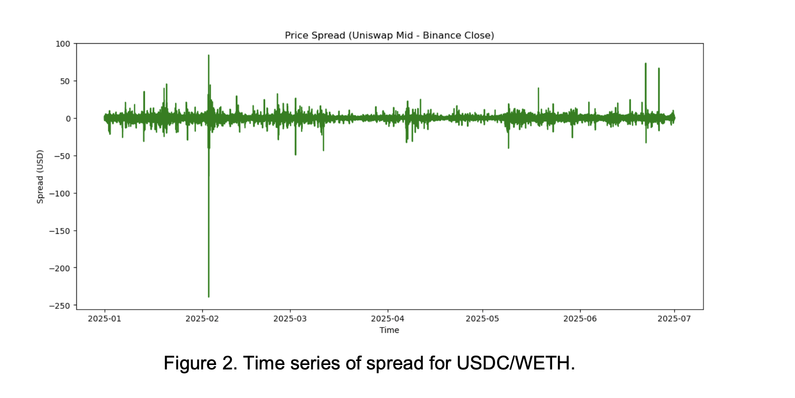
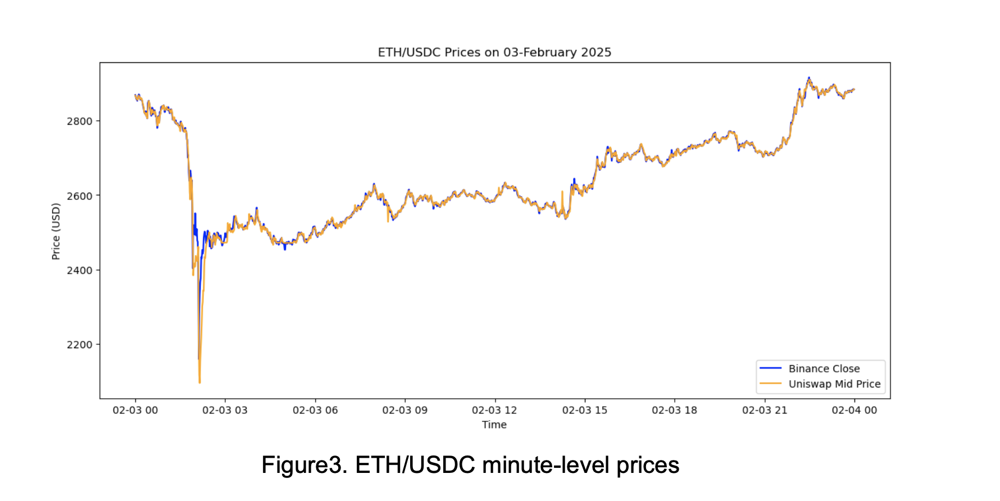

# Price Discovery and Arbitrage in ETH Markets

### A High-Frequency Comparison of Uniswap v3 and Binance

## Project Overview

This repository reproduces and extends an MSc Finance dissertation examining
how price information is incorporated across decentralized and centralized ETH
markets.

The analysis compares the Uniswap v3 USDC/WETH 0.05% liquidity pool with the
Binance ETH/USDC market using high-frequency data from 1 January to 1 July
2025. The pipeline collects transaction-level on-chain swap data, including
timestamps, transaction hashes, trader and contract addresses, trade direction,
execution prices, marginal pool prices, price impact, liquidity-provider fees,
gas costs, and all-in execution prices.

### Data Overview

*Figure 1. ETH/USDC prices on Uniswap v3 and Binance.*

*Figure 2. Price spread between Uniswap v3 and Binance.*

*Figure 3. Minute-level ETH/USDC price movements during a high-volatility period.*

Uniswap transaction data are synchronized with Binance one-minute market
prices to study both long-run price integration and short-run information
transmission. The empirical framework includes Augmented Dickey-Fuller tests,
Johansen cointegration tests, a Vector Error Correction Model, the
Gonzalo-Granger permanent-transitory decomposition, and Hasbrouck Information
Share.

The results indicate that the two markets share a long-run cointegrating
relationship. Binance generally acts as the long-run informational anchor,
while Uniswap v3 performs most of the short-run error correction when prices
temporarily diverge. Hasbrouck Information Share identifies Binance as the
leading price-discovery venue in five of the six sample months, although
Uniswap briefly leads during the high-volatility period in February.

The repository also evaluates potential cross-market arbitrage by matching
individual Uniswap swaps with contemporaneous Binance prices and accounting
for price impact, pool fees, and Ethereum gas costs. Transaction hashes and
addresses are retained to support independent on-chain verification through
Etherscan.

The current repository uses a corrected all-in-price implementation in which
the fee-inclusive Uniswap execution amounts are not charged the pool fee a
second time.
